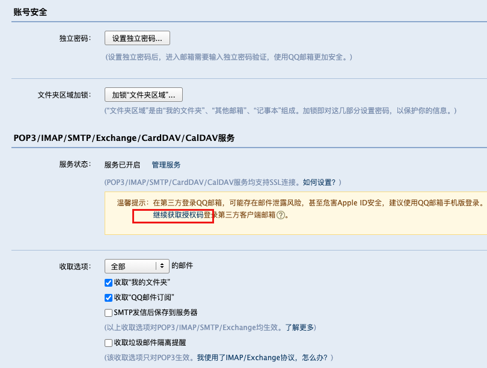

------

# mail的配置和基本使用

**视图函数使用mail组件**

~~~python
from django.shortcuts import HttpResponse
from django.core.mail import send_mail

def index(request):
    send_mail(
        'Subject here',				# 配置邮件主题
        'Here is the message.',		# 邮件内容
        'from@qq.com',				# 配置发件人
        ['liuxu_text@example.com'],	    # 支持配置多个收件人
    )
    return HttpResponse('ok')

~~~

**settings.py配置邮件服务信息**（QQ邮箱为例）

~~~python
EMAIL_HOST = "smtp.qq.com"					# 配置邮件服务器
EMAIL_PORT = 25								# 邮件服务端口
EMAIL_HOST_USER = "xxx@qq.com"				# 发件人账号
EMAIL_HOST_PASSWORD = "ncwsycmyqsytggfa"	# 发件人密码（如QQ邮箱的账号授权码）

~~~

**获取QQ邮箱授权码**

- 登录网页QQ邮箱，登录
- 点击进入设置页面，找到 邮箱设置下面的【账号】tab页
- 找到 **POP3/IMAP/SMTP/Exchange/CardDAV/CalDAV服务**，并提示操作获取授权码

------

# 模拟注册账号发激活邮件

注册账号后，用户一般会收到激活邮件，在邮件中点击激活链接，完成账号的激活。

**注册逻辑的视图函数和模板文件**

- 视图函数

~~~python
def register(request):
    if request.method == 'POST':
        # TODO: 用户提交的数据应该校验后再注册账号
        u = models.User.objects.create(
            username=request.POST.get('username'),
            password=request.POST.get('password'),	# TODO: 密码需要加密处理
        )
        return HttpResponse('ok')
    return render(request, 'register.html')

~~~

- 模板文件

~~~html
<!DOCTYPE html>
<html lang="en">
<head>
    <meta charset="UTF-8">
    <title>Title</title>
</head>
<body>
<h1>注册页面</h1>
<form action="/app01/register" method="post" enctype="application/x-www-form-urlencoded">
  
用户名: <input type="text" name="username">

  
密码: <input type="password" name="password">

  
确认密码: <input type="password" name="re_password">

  <input type="submit" value="注册">
    
</form>

</body>
</html>
~~~

**QQ邮箱发邮件，激活链接**

- 视图函数

~~~python
def register(request):
    if request.method == 'POST':
        print(request.POST)
        u = models.User.objects.create(
            username=request.POST.get('username'),
            password=request.POST.get('password'),
            age=int(request.POST.get('age')),
            birthday=request.POST.get('birthday')
        )
        send_mail(
            'Subject here',
            f'http://127.0.0.1:8000/app11/activate_account?user={u.username}',
            'liuxu_text@qq.com',
            ['liuxu_text@example.net'],
        )

        return HttpResponse('请查收邮件并点击链接激活账号')
    return render(request, 'register.html')
~~~

- 账号激活接口。用户点击激活链接，完成激活

~~~python
# 简单版
def activate_account(request):
    username = request.GET.get('user')
    if models.User.objects.filter(username=username, status=False).exists():
        models.User.objects.filter(
            username=username, status=False).update(status=True)
        return HttpResponse('激活成功')
    return HttpResponse('该账号无需激活')
~~~

------

# 使用多线程提高注册体验

注册账号的过程中，发邮件是一个非常耗时的环节，如果按照之前的编码方式，则需要用户在注册页面等待很久才能结束注册环节，用户体验是非常差的。

这种情况下可以使用多线程的方式，单独开一个子线程执行发送激活邮件的任务，主线程可以快速结束注册任务。然后用户可以悠然自得等待邮件即可。

**DEMO**

~~~python
from threading import Thread
from . import models

def send_email(user):
    send_mail(
        'Subject here',
        f'http://127.0.0.1:8000/app11/activate_account?user={user.username}',
        'liuxu_text@qq.com',
        ['liuxu_test@example.net'],
    )

def register(request):
    if request.method == 'POST':
        print(request.POST)
        u = models.User.objects.create(
            username=request.POST.get('username'),
            password=request.POST.get('password'),
        )
        # 独立线程发邮件，用户体验感更好
        t = Thread(target=send_email, args=[u])
        t.start()

        return HttpResponse('请查收邮件并点击链接激活账号')
    return render(request, 'register.html')
~~~

