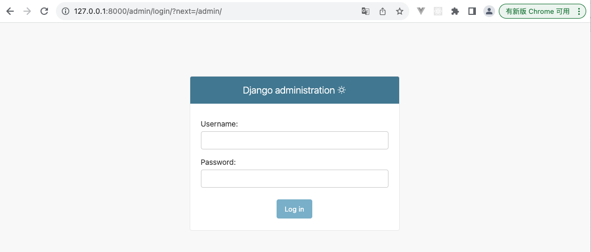
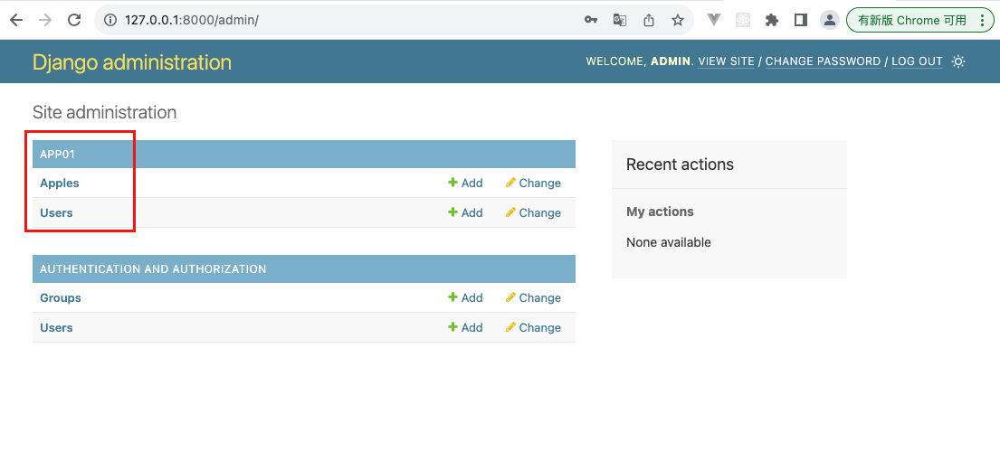
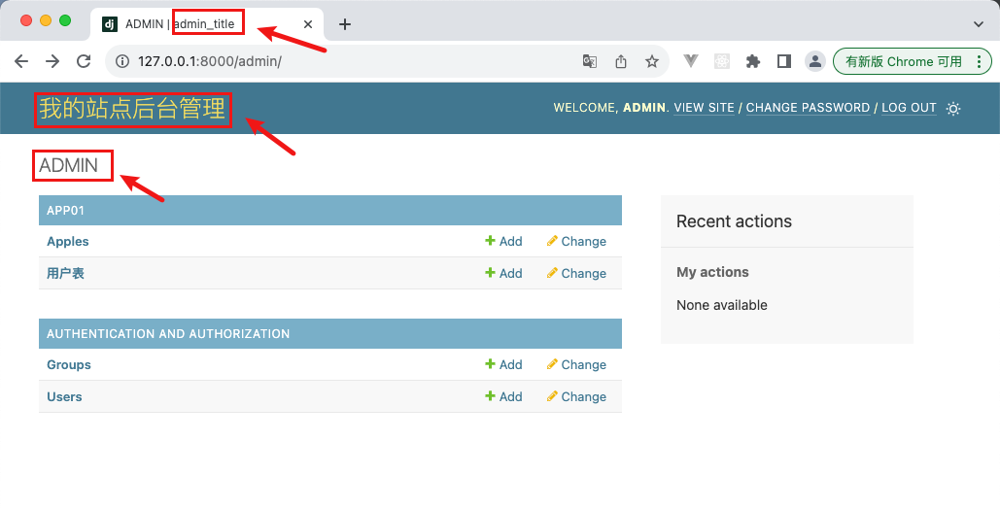
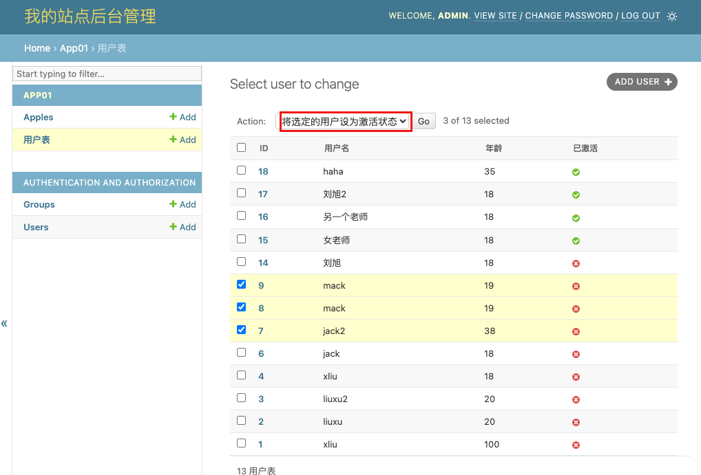

django的admin后台管理系统提供了功能强大的后台管理功能，为每一张表提供了增删改查操作。

admin的使用需要做一些基本配置：

- **创建一个admin的超级用户（管理员）**
- **将应用中的表注册到admin中，这样才可以在admin系统中操作表。**

------

# 创建管理员账号

创建admin超级用户有两种方式：命令行、代码方式

**命令行工具**

~~~
python manage.py createsuperuser
~~~

>根据提示，输入用户名、邮件（可忽略）和密码即可

**Django shell 使用代码的方式创建**

~~~python
from django.contrib.auth.models import User
	
User.objects.create_superuser(
	username='admin123',
    email='admin@qq.com',
    password='12345'
)
~~~

**注意：不论何种方式创建的用户，最终都是保存在表auth_user中**

~~~mysql
mysql> select * from auth_user \G;
*************************** 1. row ***************************
          id: 1
    password: pbkdf2_sha256$600000$TwuAXaaA6ksSP0Jj2ExdtS$jKb9zrHMYFGfKv3yr9IfcgYn+eCVhg9IPQoXuhIUnRc=
  last_login: NULL
is_superuser: 1
    username: admin
  first_name: 
   last_name: 
       email: 
    is_staff: 1
   is_active: 1
 date_joined: 2023-09-14 09:01:06.830018
*************************** 2. row ***************************
          id: 2
    password: pbkdf2_sha256$600000$Fiv06hszcTcIN0tUwEsxCX$wkf7Xu+IlIBws52weJQwFWVbGQy3tPEVIfwUD41JWBs=
  last_login: NULL
is_superuser: 1
    username: admin123
  first_name: 
   last_name: 
       email: admin@qq.com
    is_staff: 1
   is_active: 1
 date_joined: 2023-09-14 09:05:47.180549
2 rows in set (0.00 sec)
~~~

**访问 admin**

1. 运行项目，浏览器访问：`http://127.0.0.1:8000/admin`
2. 使用创建的用户名和密码登录即可

>之所以可以访问 `/admin` 是因为django项目下面的urls.py中自带路由匹配（内置admin页面）

------

# 注册并管理表

默认情况下，admin页面中并没有我们自己创建的应用的表，需要手动注册后才能在admin中展示和操作。

**在应用下的`admin.py`文件中注册你的模型表**

~~~python
from django.contrib import admin

# Register your models here.

from . import models

admin.site.register(models.User)
admin.site.register(models.Apple)
~~~

注册后重启项目，在浏览器访问admin页面

然后就可以通过鼠标点击的方式操作表中数据了。

**补充**：admin会给每一个注册了的模型表自动生成增删改查四条url

~~~
app01下面的user表
http://127.0.0.1:8000/admin/app01/user/  查
http://127.0.0.1:8000/admin/app01/user/add/  增
http://127.0.0.1:8000/admin/app01/user/18/change/  改
http://127.0.0.1:8000/admin/app01/user/18/delete/  删

app01下面的apple表
http://127.0.0.1:8000/admin/app01/apple/  查
http://127.0.0.1:8000/admin/app01/apple/add/  增
http://127.0.0.1:8000/admin/app01/apple/8/change/  改
http://127.0.0.1:8000/admin/app01/apple/8/delete/  删
~~~

------

# 后台页面基本配置

admin页面有很多配置项，比如表名、字段名、提示信息等等。

~~~python
from django.db import models

class User(models.Model):
    objects: models.query.QuerySet

    SEX = [
        (0, '男'),
        (1, '女'),
        (2, '其他'),
    ]

    class SexChoices(models.IntegerChoices):
        MALE = 0, '男'
        FEMALE = 1, '女'
        OTHER = 2, '其他'

    id = models.AutoField(primary_key=True)
    username = models.CharField(
        max_length=100,
        verbose_name='用户名',
        help_text='请输入用户名',

    )
    password = models.CharField(max_length=100, verbose_name='密码')
    age = models.IntegerField(verbose_name='年龄')
    birthday = models.DateField(auto_now_add=True, verbose_name='生日')
    sex = models.SmallIntegerField(default=0, choices=SexChoices.choices, verbose_name='性别')

    def __str__(self):
        # 控制展示页面展示的内容
        return f'id: {self.id}, username: {self.username}, age: {self.age}'

    class Meta:
        verbose_name_plural = '用户表'
~~~

**admin页面也可以配置**

- 在 admin.py中

~~~python
from django.contrib import admin

# Register your models here.

from . import models

admin.site.register(models.User)
admin.site.register(models.Apple)

# 如下基本配置
admin.site.site_header = '我的站点后台管理'
admin.site.index_title = 'ADMIN'
admin.site.site_title = 'admin_title'
~~~

------

# 自定义展示的表字段

django admin注册模型时提供了两种方式，一种的简单的方式（前两小节的方式）

~~~python
# 基础注册方式（展示所有字段）
from django.contrib import admin
from . import models

admin.site.register(models.User)
admin.site.register(models.Apple)
~~~

同时，为了方便自定制admin功能，Django提供了**ModelAdmin**的方式，这种方式更加灵活。

>更多详情参考官方文档：https://docs.djangoproject.com/en/4.2/ref/contrib/admin/#modeladmin-objects

~~~python
from django.contrib import admin
from . import models

admin.site.site_header = '我的站点后台管理'
admin.site.index_title = 'ADMIN'
admin.site.site_title = 'admin_title'

class UserAdmin(admin.ModelAdmin):
    list_display = ['id', "username", 'age']    # 列表展示字段
    fields = ["username", "age"]    			# 新建/编辑时的字段
    exclude = ["sex"]       					# 排除的不展示字段

admin.site.register(models.User, UserAdmin)
admin.site.register(models.Apple, AppleAdmin)
~~~

------

# 自定义action

默认的action应该满足不了大多数的需求，因此Django提供了自定义action的功能

**案例：批量激活账号action**

- models.py 增加一个status字段，0表示未激活，1=已激活

~~~python
import time

from django.db import models

class User(models.Model):
    objects: models.query.QuerySet

    SEX = [
        (0, '男'),
        (1, '女'),
        (2, '其他'),
    ]

    class SexChoices(models.IntegerChoices):
        MALE = 0, '男'
        FEMALE = 1, '女'
        OTHER = 2, '其他'

    id = models.AutoField(primary_key=True)
    username = models.CharField(
        max_length=100,
        verbose_name='用户名',
        help_text='请输入用户名',

    )
    password = models.CharField(max_length=100, verbose_name='密码')
    age = models.IntegerField(verbose_name='年龄')
    birthday = models.DateField(auto_now_add=True, verbose_name='生日')
    sex = models.SmallIntegerField(default=0, choices=SexChoices.choices, verbose_name='性别')
    status = models.BooleanField(default=0, verbose_name='已激活')

    def __str__(self):
        # 控制展示页面展示的内容
        return f'id: {self.id}, username: {self.username}, age: {self.age}'

    class Meta:
        verbose_name_plural = '用户表'

~~~

- admin.py 配置

~~~python
from django.contrib import admin

# Register your models here.

from . import models

admin.site.site_header = '我的站点后台管理'
admin.site.index_title = 'ADMIN'
admin.site.site_title = 'admin_title'

# 按照格式定义action
def make_activated(modeladmin, request, queryset):
    # 自定义操作的逻辑
    queryset.update(status=1)

# 自定义操作的显示名称
make_activated.short_description = "将选定的用户设为激活状态"  

class UserAdmin(admin.ModelAdmin):
    list_display = ['id', "username", 'age', 'status']    # 列表展示字段
    # fields = ["username", "age"]    # 新建/编辑时的字段
    exclude = ["sex"]       # 排除的不展示字段

    # 将自定义操作添加到 actions 列表中
    actions = [make_activated]

class AppleAdmin(admin.ModelAdmin):
    pass

admin.site.register(models.User, UserAdmin)
admin.site.register(models.Apple, AppleAdmin)
~~~

- 查看admin页面

