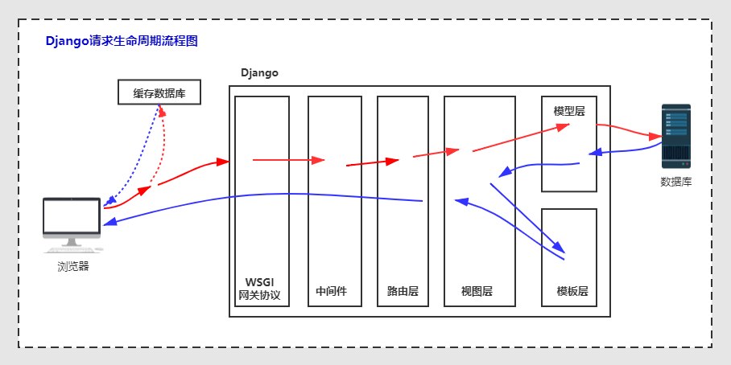
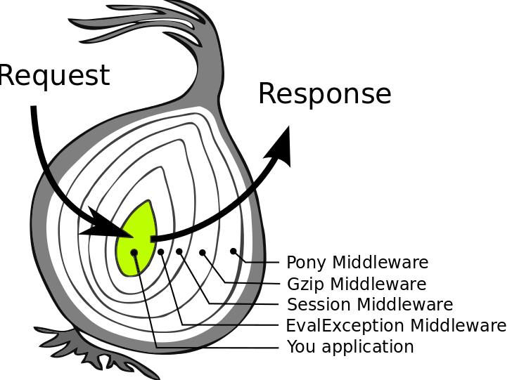

# 13 Django中间件


## Django请求生命周期

Django请求生命周期，也称Django生命周期流程图。本质上说就是在请求进来时，django是如何处理这个请求的，中间经历了哪些环节。



下面是Django请求的生命周期：

1. 用户发送请求：当用户在浏览器中输入URL或点击链接时，请求被发送到Django应用程序的服务器。
2. URL匹配：Django的URL分发器根据URL配置文件中定义的URL模式对请求的URL进行匹配。
3. 中间件处理：如果在Django应用程序中启用了中间件，请求将被传递给中间件处理。中间件可以执行各种任务，例如身份验证、日志记录、请求转换等。
4. 视图函数处理：一旦URL匹配成功并通过中间件处理，Django将调用与匹配URL模式相关联的视图函数。视图函数是处理请求并生成响应的核心部分。
5. 请求对象创建：Django将请求的元数据（如请求头、请求方法、请求参数等）封装到一个HttpRequest对象中，并将其作为参数传递给视图函数。
6. 视图函数处理：视图函数根据请求的方法（GET、POST等）和其他参数（如URL参数、表单数据等）执行相应的逻辑。它可能会与数据库进行交互、执行业务逻辑、渲染模板等。
7. 模板渲染：如果视图函数需要渲染模板，它将使用请求的数据来填充模板中的变量，并生成最终的HTML响应。
8. 响应对象创建：Django将最终的响应内容封装到一个HttpResponse对象中，并将其返回给服务器。
9. 中间件处理：响应对象通过中间件进行处理。中间件可以对响应进行修改、添加额外的响应头、进行缓存等。
10. 响应发送：最后，响应被发送回客户端，显示在用户的浏览器中。


这是Django请求的基本生命周期，其中包含了URL匹配、中间件处理、视图函数处理、模板渲染和最终的响应发送。通过理解这个生命周期，可以更好地理解Django应用程序的请求处理过程。


## 中间件

Django 中间件是在请求和响应处理过程中介入的组件，它可以对请求和响应进行预处理、后处理或者进行其他操作。中间件可以用于实现各种功能，如身份验证、日志记录、缓存、跨域资源共享（CORS）等。

- django 中间件可以有多个，比如，内置了多个中间件。此外，还支持用户自定义中间件。
- 处理流程：请求进来时，依次经过每个中间件，在响应阶段，反向依次经过每个中间件。
- 总结：请求进来时做一些操作，响应回去时做一些操作。




中间件是一个Python类，通过定义一系列的方法来处理请求和响应

**手动创建中间件**

~~~python
from django.http import HttpRequest, HttpResponse


class MyMiddleware:
    def __init__(self, get_response):
        self.get_response = get_response

    def __call__(self, request: HttpRequest) -> HttpResponse:
        print('请求前做一些操作')
        print(request.path)
        res = self.get_response(request)
        print('响应后做一些操作')
        print(res.content)

        return res

~~~

**注册中间件 settings.py**

- django自带了7个内置中间件，我们自定义的中间件也需要在这个位置注册后才能使用。

~~~python
MIDDLEWARE = [
    'django.middleware.security.SecurityMiddleware',
    'django.contrib.sessions.middleware.SessionMiddleware',
    'django.middleware.common.CommonMiddleware',
    'django.middleware.csrf.CsrfViewMiddleware',
    'django.contrib.auth.middleware.AuthenticationMiddleware',
    'django.contrib.messages.middleware.MessageMiddleware',
    'django.middleware.clickjacking.XFrameOptionsMiddleware',
    'app01.middlewares.MyMiddleware',	# 按照路径 注册我们自定义的中间件
]
~~~


## 中间件的执行顺序

按照注册中间件的注册顺序

- 请求阶段，从上往下
- 响应阶段，从下往上

>理解记忆：洋葱模型


~~~python
from django.http import HttpRequest, HttpResponse


class MyMiddleware1:
    def __init__(self, get_response):
        self.get_response = get_response

    def __call__(self, request: HttpRequest) -> HttpResponse:
        print('MyMiddleware1, 请求')
        res = self.get_response(request)
        print('MyMiddleware1, 响应')

        return res

    
class MyMiddleware2:
    def __init__(self, get_response):
        self.get_response = get_response

    def __call__(self, request: HttpRequest) -> HttpResponse:
        print('MyMiddleware2 请求')
        res = self.get_response(request)
        print('MyMiddleware2, 响应')

        return res
~~~

配置settings.py

~~~python
MIDDLEWARE = [
    'django.middleware.security.SecurityMiddleware',
    'django.contrib.sessions.middleware.SessionMiddleware',
    'django.middleware.common.CommonMiddleware',
    'django.middleware.csrf.CsrfViewMiddleware',
    'django.contrib.auth.middleware.AuthenticationMiddleware',
    'django.contrib.messages.middleware.MessageMiddleware',
    'django.middleware.clickjacking.XFrameOptionsMiddleware',
    
    'app01.middlewares.MyMiddleware1',
    'app01.middlewares.MyMiddleware2',
]
~~~


打印结果

~~~
MyMiddleware1, 请求
MyMiddleware2 请求
....
MyMiddleware2, 响应
MyMiddleware1, 响应
~~~


## 使用MiddlewareMixin创建中间件

为了方便自定义中间件，Django提供了一个便捷方式：自定义类的时候继承 MiddlewareMixin，然后按需要定义合适的方式即可：

- **process_request** 【**常用**】
- **process_response** 【**常用**】
- process_view
- process_template_response
- process_exception


**请求来的时候穿过的方法**：`process_request`

- 请求阶段，经过每一个中间件的 `process_request` 方法；
- 如果一个中间件里面没有定义该方法，那么直接跳过执行下一个中间件的 `process_request` 方法；
- 如果该方法返回了 `HttpResponse` 对象，那么请求将不再继续往后执行而是直接原路返回，进入响应阶段；返回的是其他数据，则不会影响请求进入下一个中间件；

```python
from django.utils.deprecation import MiddlewareMixin


class MyMiddleWare(MiddlewareMixin):

    def process_request(self, request):
        print('我是第1个process_request')
```


**响应走的时候穿过的方法**：`process_response`

- 响应阶段，经过每一个中间件里面的 `process_response` 方法；
- 该方法有两个参数`request`，`response`；
- 该方法必须返回一个`HttpResponse`对象：默认情况下返回的就是形参`response`，你也可以自己返回被换成自己的；
- 执行顺序是注册的中间件从下往上依次经过，如果你没有定义的话，直接跳过执行下一个（**原路返回**）；
- 如果在第一个`process_request`方法就已经返回了`HttpResponse`对象，则会直接走同级别的`process_reponse`返回，不再执行后续其他中间件和视图函数了。

```python
from django.utils.deprecation import MiddlewareMixin
from django.shortcuts import HttpResponse


class MyMiddleWare(MiddlewareMixin):

    def process_response(self, request, response):

        print('我是第1个process_response')
        return response
    	# return HttpResponse('狸猫换太子')
```


**其他三个方法（了解）**：

```python
# process_view

	- 路由匹配成功之后执行视图函数之前，会自动执行中间件里面的process_view方法
	- 顺序是按照配置文件中注册的中间件从上往下的顺序依次执行
    - 形参view_name是请求url匹配到的视图函数
    - 该方法要么不写返回值，要么返回值必须是一个HttpResponse对象
    - 如果该方法返回了HttpResponse对象，那么请求将不再进入下一个中间件的process_view和视图函数，而是直接沿着原路径的process_response方法返回。
    
    def process_view(self, request, view_name, *args, **kwargs):
        print(view_name, args, kwargs)
        print('我是第1个process_view')
        # return HttpResponse('123')


# process_template_response

	- 返回的HttpResponse对象有render属性的时候才会触发
	- 顺序是按照配置文件中注册了的中间件从下往上依次经过,现在属于返回阶段了，方法都是从上往下执行。
    
    def process_template_response(self, request, response):
        print('我是第1个process_template_response')
        return response
    
    # views.py
    def index(request):
        print('index页面')
        obj = HttpResponse('index')

        def render():
            print('内部的render')
            return HttpResponse("O98K")
        obj.render = render
        return obj


    
# process_exception

	- 当视图函数中出现异常的情况下触发
	- 顺序是按照配置文件中注册了的中间件从下往上依次经过， 属于返回阶段了
    
    def process_exception(self, request, exception):
        print('我是第1个process_exception')
        print(exception)
```


## 中间件实现登录验证

有些网站的某些网页需要登陆后的用户才能浏览，这种机制我们可以使用中间件来实现。

实际上，这里面涉及到登录认证的知识点（后面我们会详细介绍），但现在我们可以先试用中间件的概念介绍模拟这种现象。

**注意**：在中间件中实现登录认证并不是唯一的方法，也不是最好的方法。本节内容只是让大家理解这种概念。

视图函数

- 登录成功后给浏览器一个cookie作为后面认证的凭证，浏览器后面再访问这个网站的其他页面时都会携带这个凭证。

~~~python
def login(request):
    if request.method == 'GET':
        return render(request, 'login.html')
    else:
        username = request.POST.get('username')
        password = request.POST.get('password')
        if username == 'liuxu' and password == '12345':
            res = HttpResponse('login success')
            res.cookies['xxx'] = 'QWERT'
            return res
        else:
            return HttpResponse('login failed')


def home(request):
    return HttpResponse('home')


def vip(request):
    return HttpResponse('vip page')
~~~


中间件处理

- 如果访问的URL是 /app01/vip 页面需要登录认证（检查cookie中是否有登录凭证），有且正确就放行，没有的话调整到登录页

~~~python
from django.http import HttpRequest, HttpResponse
from django.shortcuts import redirect


class AuthMiddleware:
    def __init__(self, get_response):
        self.get_response = get_response

    def __call__(self, request: HttpRequest) -> HttpResponse:
        xxx = request.COOKIES.get('xxx')
        path = request.path_info
        print(path, xxx)
        if path == '/app01/vip' and xxx != 'QWERT':
            return redirect('/app01/login')
        res = self.get_response(request)

        return res
~~~


## 中间件实现限流

在Django中，可以使用中间件来实现请求限流。请求限流是一种控制请求频率的机制，可以防止恶意用户或者过多的请求对服务器造成过大的压力。下面是一个简单的示例，演示如何在Django中使用中间件进行请求限流。

基于IP的限流中间件，每个IP一分钟最多访问10次

- 在每个请求到达服务器时，中间件会检查请求的IP地址，并根据设定的限制值来判断请求是否超过了频率限制。
- 我们使用Django的缓存系统来记录每个IP地址的请求计数器，以及计数器的过期时间。

```python
class RateLimitMiddleware:
    def __init__(self, get_response):
        self.get_response = get_response

    def __call__(self, request):
        # 限制每个IP地址的请求频率为10次/分钟
        ip_address = request.META.get('REMOTE_ADDR')
        key = f'rate_limit:{ip_address}'
        limit = 10
        timeout = 60

        # 检查请求频率是否超过限制
        count = cache.get(key, 0)
        if count >= limit:
            return HttpResponse('请求频率超过限制，请稍后再试。')
        else:
            # 增加请求计数器，并设置过期时间
            cache.set(key, count + 1, timeout)
            return self.get_response(request)
```


