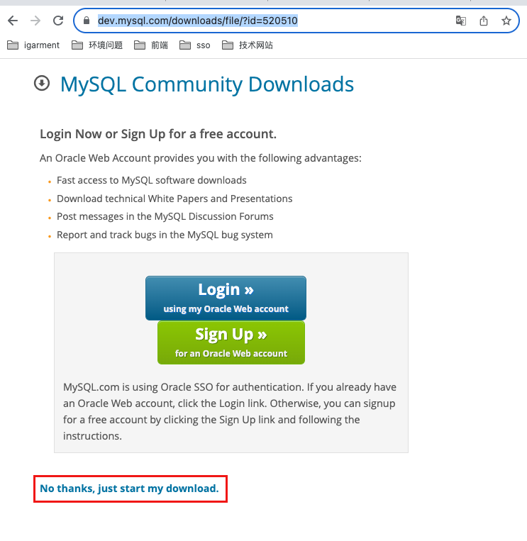
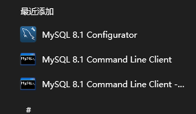
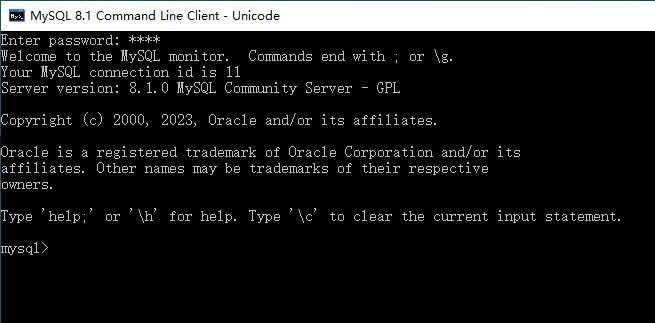
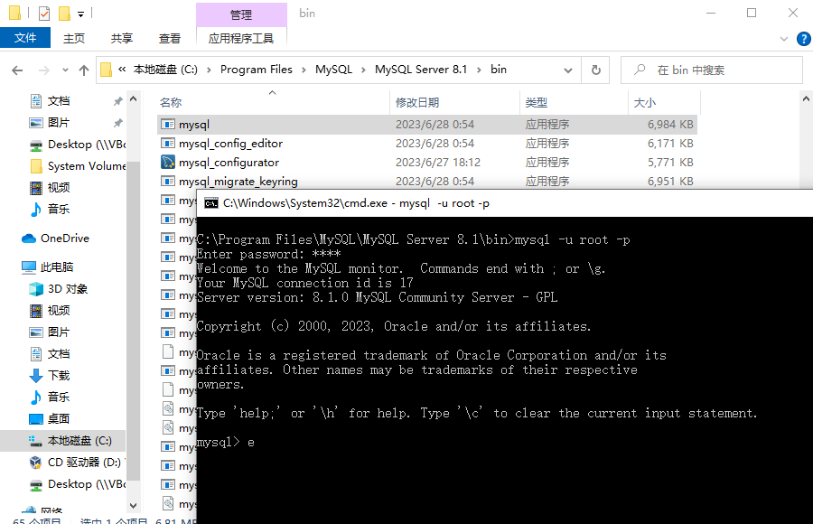
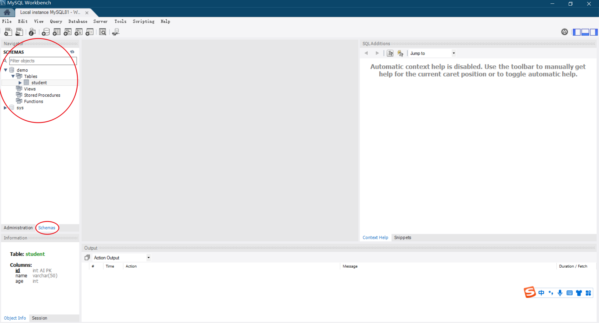

学习 MySQL 对于后端开发人员来说至关重要，它提供了强大的数据存储与管理能力、高效的查询与优化技巧、数据安全性保障以及与常用后端框架的无缝集成，使开发人员能够构建可靠、高性能的应用程序。


------

# 数据库管理软件

开发程序，一般都需要将数据保存起来，简单点我们可以把数据保存在文件夹中的文件里面（txt，excel等）。但是当数据处理变得复杂一点时，就会遇到很多问题，

- 数据库查询
- 数据修改
- 并发、线程问题


为了解决这个问题，出现了一类软件：**数据库管理系统**（DBMS），可以帮助我们实现对文件夹中的文件进行操作，我们只需要学习几个简单的指令，就可以让DBMS帮助我们实现文件和数据的管理。

数据库管理软件：

- **MySQL**：互联网公司使用较多。【免费+服务】
- Oracle：甲骨文公司，后来收购了 MySQL，【收费】
- Microsoft SQL Serve：微软，适用于Windows平台 【收费】
- PostgreSQL：加州大学伯克利分校 【收费】
- SQLite：轻量级个人开发数据库【免费】
- MongoDB：一个开源的NoSQL数据库管理系统【免费】
- **Redis**：一个基于内存的开源键值存储数据库管理系统【免费】


由于MySQL和Redis这两个软件使用的最多，因此我们课程会给大家讲解这两个软件。


学习数据库管理软件的流程：

- 在自己电脑上安装并运行 MySQL。
- 学习使用 MySQL的指令，让 MySQL帮我们管理和操作数据。
- 学习 pymysql，使用 Python 让 MySQL帮我们操作管理数据。
- SQL优化和其他MySQL的相关知识【需要大家后期慢慢学】


------

# 安装和配置MySQL

MySQL社区版是免费的，大家可以到MySQL官网放心下载。


**下载MySQL**

- MySQL官方提供了多种安装方式，有 MSI Installer、ZIP压缩包、MySQL Installer。在windows上推荐大家使用MSI Installer的安装，自动安装配置，无需再手动配置。这种安装包的下载地址如下。
- https://dev.mysql.com/downloads/file/?id=520510



**安装依赖**

因为MSI Installer的安装的方式需要依赖 Microsoft Visual C++ Redistributable packages，所以安装MySQL前，需要下载安装一个小东西。（微软官网：https://learn.microsoft.com/en-us/cpp/windows/latest-supported-vc-redist?view=msvc-170

）

64位下载地址：https://aka.ms/vs/17/release/vc_redist.x64.exe

下载后，双击直接运行即可。


**安装MySQL**

下载好安装包后，双击运行，直接傻瓜式下一步即可，中间其中选择典型安装。


**配置MySQL**

安装完成后，在开始菜单可以看到出现三个选项。选择Configurator，对MySQL进行配置，配置完成后，使用Client或者 Client Unicode连接MySQL。



最后看到如下页面，就表示MySQL顺利安装并配置好了。




**扩展**

- 如果你以前接触过MySQL，希望继续在cmd命令行中使用MySQL，那也是可以的。找到MySQL的安装位置，进入bin文件夹，在终端中输入如下指令即可。
- 如果你设置了环境变量，那在命令行中的任何路径下都可以使用这个命令连接MySQL




------

# MySQL使用初体验

**查看数据库**

MySQL是数据库管理软件，那它就会帮我们管理很多数据库（类似电脑上有很多文件夹）。那该如何查看数据库呢（类似如何查看电脑上的文件夹）？

- 查看数据库

~~~mysql
show databases;			-- 指令大小写都可以，推荐使用大写方式
SHOW DATABASES;
~~~

>MySQL命令以分号`;`结尾


- 切换数据库

~~~mysql
USE <name_of_database>		-- USE语句可以不使用结尾的分号
USE <namd_of_database>;
~~~

>实际使用时，把 <name_of_database> 换成实际数据库名字即可


- 查看一个数据库中有哪些表

~~~mysql
USE mysql;		-- 比如, 进入系统自带的mysql这个数据库
SHOW TABLES;
~~~


- 新建一个数据库

~~~mysql
CREATE DATABASE <name_of_db>;		-- 默认字符集是 utf8mb4
CREATE DATABASE <name_of_db> CHARSET='gbk';		-- 创建时指定字符集
SHOW DATABASES;
~~~

>实际使用时，把 <name_of_database> 换成实际数据库名字即可


- 新建一张表

~~~mysql
USE demo;

-- 新建一张学生表，有三个字段，分别是：id、name、age
CREATE TABLE student (
  id INT PRIMARY KEY AUTO_INCREMENT,
  name VARCHAR(50),
  age INT
);
~~~

>因为有多个字段且换行，所以使用 `()`把所有字段包裹在一块。
>
>新建表时每个字段都需要字段类型和约束条件，我们后面再介绍。


- 查看有哪些表

~~~mysql
SHOW TABLES;
~~~


- 查看表结构

~~~mysql
DESCRIBE student;
~~~

- 插入一行数据

~~~mysql
INSERT INTO student(id, name, age) VALUES(1, 'LIUXU', 18);
~~~

- 查询语句

~~~mysql
SELECT id, name FROM student;	-- 查询表中所有行中 id和nane对应的数据
SELECT * FROM STUDENT;			-- 查询所有字段的数据
~~~


------

# 库的操作

数据库的操作最简单，并且平时用的也不多。有如下四个关键词：`create`、`show`、`alter`、`drop`

- 进入数据库使用：`USE`
- 创建库

~~~mysql
CREATE DATABASE <dbname>;
CREATE DATABASE <dbname> CHARSET='gbk'	-- 指定字符编码为gbk
~~~


- 查看库

~~~mysql
SHOW DATABASES;						-- 查看所有库
SELECT DATABASE();					-- 查看当前在哪个库里面
SHOW CREATE DATABASE <dbname>;		-- 查看某个库的创建语句
~~~


- 修改库

~~~mysql
ALTER CREATE <dbname> CHARSET='utf8';		-- 修改库的字符集编码为 utf8
~~~


- 删除库

~~~mysql
DROP DATABASE <dbname>;
~~~


------

# 表的操作

表的操作稍微复杂，并且使用频率也要高一点。操作表，一般需要在指定的库里面操作。

- 新建表

~~~mysql
CREATE TABLE t1(id int, name char(6));	-- 新建表t1,具有两个字段:id、name

-- 完整语法
/*
CREATE TABLE 表名(
	字段名1 类型(宽度) 约束条件,
    字段名2 类型(宽度) 约束条件,
    字段名3 类型(宽度) 约束条件
);
*/
~~~

>新建表一般需要如下信息：表明，每个字段名、字段的类型、字段的约束条件、索引等。
>
>常见的字段类型：int、float、char、varchar、datetime、date、time等。
>
>约束条件：default默认值、primary key主键、auto_increment自增、unique唯一键等。
>
>==注意==：
>
>- 在同一张表中字段名不能重复
>- 最后一行不能有逗号，否则报错


- 查看表信息

~~~mysql
SHOW TABLES;			-- 查看当前库所有表
SHOW CREATE TABLE t1;	-- 查看指定表的创建语句
DESCRIBE t1;	 		-- 查看指定表，可简写为 desc t1;
DESC t1;			 	-- 查看某个库的信息
~~~


- 修改表

~~~mysql
-- 修改表名 rename
ALTER TABLE 表名 RENAME 新表名;


-- 增加字段  add first、 after
ALTER TABLE 表名 ADD 字段名 字段类型(宽度)  约束条件;
ALTER TABLE 表名 ADD 字段名 字段类型(宽度)  约束条件 FIRST;
ALTER TABLE 表名 ADD 字段名 字段类型(宽度)  约束条件 AFTER 字段名;


-- 删除字段 # drop
ALTER TABLE 表名 DROP 字段名;


--	修改字段 # modify、 change
ALTER TABLE 表名 MODIFY 字段名 字段类型(宽度) 约束条件;
ALTER TABLE 表名 CHANGE 旧字段名 新字段名 字段类型(宽度) 约束条件;
~~~


- 删除表

~~~mysql
-- 删除一张表的表结构和虽有数据，删除表就不存在了，需要重新创建
DROP TABLE 表名


-- 删除一张表的数据，不删表结构（删除后表仍然存在）
DELETE FROM FROM 表名					-- 全删
DELETE FROM FROM 表名 WHERE id=1;		-- 删除指定行数据


-- 清空重置一张表，同时重置自增计数器（如果有，也是仅删除数据
TRUNCATE 表名 
~~~

>与DELETE FROM不同，TRUNCATE TABLE是一种更快速且资源消耗较少的方式来清空表中的数据。
>
>与DROP TABLE不同，TRUNCATE TABLE只删除数据而不删除表本身。


------

# 数据的操作

实际开发中，数据的操作是最频繁的，也是最重要的。

- 增加数据

~~~mysql
INSERT IINTO t1 VALUES(1, 'jack');
INSERT t1 VALUES(2,'jane');				-- 可省略 into
INSERT t1 VALUES(3,'tom'),(4,'lili');	-- 同时插入多条数据
~~~


- 查询数据

~~~mysql
SELECT * FROM t1;					-- 查询t1表的所有字段下数据
SELECT name FROM t1;				-- 查询t1表内name字段下的数据
SELECT name FROM t1 WHERE id = 1;	-- 修改指定条件的数据
~~~


- 修改数据

~~~mysql
UPDATE t1 SET name='dsb' WHERE id >= 1;		-- 修改指定条件的数据
UPDATE t1 SET name='dsb';					-- 修改所有的数据
~~~


- 删除数据

~~~mysql
DELETE FROM t1 WHERE id > 1;			-- 删除指定条件的数据
DELETE FROM t1 WHERE name = 'jack';	
DELETE FROM t1;							-- 清空表，即删除表内所有数据
~~~


------

# 查询语句

MySQL的查询语句是实际开发中使用频率最多的，因此这也是学习MySQL时必须要掌握的。


- 关键字的语法顺序。这是一个查询语句典型的查询语法和关键词。

```sql
SELECT DISTINCT field_list
FROM <table_name>
WHERE <where_condition>
GROUP BY <group_by_list>
HAVING <having_condition>
ORDER BY <order_by_condition>
LIMIT <limit_number>
```


- **where筛选条件**

~~~mysql
-- 查询id大于等于3小于等于6的数据
SELECT id, name FROM emp WHERE id >=3 AND id <=6;
~~~

>筛选条件：
>
><1> 支持 and not or 逻辑判断
><2> 支持 > < = 等比较运算;
><3> 范围 where id between 3 and 10
><4> 支持 成员运算 in、not in 如 salary in (2000, 4000, 6000)
><5> 模糊查询  like "%"(匹配任意多个字符)；"_"(匹配任意单个字符)
><6> 注意 null的字段不能使用等号匹配，必须使用 is 关键词 post_comment is null


- **order by排序**

对去重后的数据做排序，使用关键字 `asc` 为升序；使用关键字 `desc` 为降序。默认升序。

```sql
select * from student order by age;  		-- 默认升序
select * from student order by age asc; 	-- 升序 ascend
select * from student order by age desc;	-- 降序 descand
```


- **limit 限制展示条数**

<1> limit后跟一个数字，表示从头开始展示的条数

<2> limit后跟两个数字，第一个参数是起始位置，第二个参数是展示的条数

```sql
select * from student limit 3;  	-- 只展示三条数据， 1 2 3
select * from student limit 0,5;	-- 展示，1 2 3 4 5
select * from student limit 5,5;	-- 展示，6 7 8 9 10
```


**———— 后面的就靠大家自学了，不再本课程的知识点之内！！！！**

- **group by分组**

按照某种逻辑分类分组，然后以组为单位统计分析数据。

**分组后不能使用表内普通字段**作为select后的查询字段，**只能使用分组字段或者使用聚合函数**

```python
<1> 如果没有设置严格模式，分组后使用非分组字段，则会返回组内第一个该字段数据
<2> 如果设置了严格模式，分组后是哟个非分组字段，则直接报错
<3> set global sql_mode = 'strict_trans_tables, only_full_group_by';
```

**聚合函数** group function

```sql
max() min() sum() avg() count() 
group_concat() 分组后使用，获取表内字段的数据，字符拼接
concat() 不分组使用

# 查询分组之后的部门名称和每个部门下所有的员工姓名和薪资 
select post, group_concat(name,':',salary) from emp group by post;
```

**补充**：`as`可以给字段起别名，也可以直接省略不写 (推荐不省略的写法，语意清晰)

```python
select post as '部门',max(salary) as '最高薪资' 
from emp 
group by post;
```

>**分组注意事项**：
>
><1> 关键字`where`和`group by`同时出现的时候group by必须在where的后面
>
><2> where先对整体数据进行过滤之后再分组操作
>
><3> where后面的筛选条件不能使用聚合函数
>
><4> 如果不分组，表示默认表整体就是一组


- **having 筛选条件**

**having是分组之后的筛选**，可以直接使用聚合函数

~~~mysql
select post, avg(salary) from emp 
where age>30 
group by post
having avg(salary) > 10000;
~~~


- **distinct 去重**

去重，数据必须完全一样才能去重，不要忽视主键的存在，**主键或者说编号不一样不能去重**。

```sql
select distinct id, age from emp; # 无法去重
select distinct age from age;
```


------

# 数据类型

MySQL 支持多种类型，大致分三类：数值、日期/时间和字符串(字符)类型。


- **数值类型**

| 类型      | 大小                   | 有符号范围                                                   | 无符号范围                      |
| --------- | ---------------------- | ------------------------------------------------------------ | ------------------------------- |
| TINYINT   | 1 字节                 | -128 到 127                                                  | 0 到 255                        |
| SMALLINT  | 2 字节                 | -32,768 到 32,767                                            | 0 到 65,535                     |
| MEDIUMINT | 3 字节                 | -8,388,608 到 8,388,607                                      | 0 到 16,777,215                 |
| INT       | 4 字节                 | -2,147,483,648 到 2,147,483,647                              | 0 到 4,294,967,295              |
| BIGINT    | 8 字节                 | -9.22 x 10^18 到 9.22 x 10^18                                | 0 到 1.84 x 10^19               |
| FLOAT     | 4 字节                 | -3.40 x 10^38 到 -1.18 x 10^-38, 0 和 1.18 x 10^-38 到 3.40 x 10^38 | 1.18 x 10^-38 到 3.40 x 10^38   |
| DOUBLE    | 8 字节                 | -1.79 x 10^308 到 -2.23 x 10^-308, 0 和 2.23 x 10^-308 到 1.79 x 10^308 | 2.23 x 10^-308 到 1.79 x 10^308 |
| DECIMAL   | 取决于定义的精度和范围 | 取决于定义的精度和范围                                       | 取决于定义的精度和范围          |

补充：

- 创建表字段时可以指定整型字段时无符号的 `unsigned`
- 精度不同 float < double < decimal

~~~mysql
float(255,30)  # 总共255位 小数部分占30位
double(255,30)  # 总共255位 小数部分占30位
decimal(65,30)  # 总共65位 小数部分占30位
~~~


- **字符串(字符)类型**

CHAR适用于长度固定的字符串，VARCHAR适用于长度可变的字符串，而TEXT适用于存储大量文本数据

| 类型    | 最大长度                  | 描述                           |
| ------- | ------------------------- | ------------------------------ |
| CHAR    | 最大存储长度为255个字符   | 固定长度字符串，右侧用空格填充 |
| VARCHAR | 最大存储长度为65535个字符 | 可变长度字符串，不填充空格     |
| TEXT    | 最大存储长度为65535个字符 | 长文本类型                     |


- **日期和时间类型**

| 类型      | 存储范围                                       | 描述                                       |
| --------- | ---------------------------------------------- | ------------------------------------------ |
| DATE      | '1000-01-01' 到 '9999-12-31'                   | 日期值，格式为 'YYYY-MM-DD'                |
| TIME      | '-838:59:59' 到 '838:59:59'                    | 时间值，格式为 'HH:MM:SS'                  |
| DATETIME  | '1000-01-01 00:00:00' 到 '9999-12-31 23:59:59' | 日期和时间值，格式为 'YYYY-MM-DD HH:MM:SS' |
| TIMESTAMP | '1970-01-01 00:00:01' 到 '2038-01-19 03:14:07' | 时间戳值，格式为 'YYYY-MM-DD HH:MM:SS'     |
| YEAR      | 1901 到 2155                                   | 年份值，格式为 'YYYY'                      |


------

# 约束条件

约束条件，就是限制约束字段的条件。MySQL中有很多约束条件，我们这里介绍几个非常重要且常用的。


- **default 默认值**。设置了默认值的字段，如果插入行时没有提供具体值，则将使用默认值。

~~~mysql
USE demo;
DROP TABLE student;
CREATE TABLE student(
	id INT PRIMARY KEY AUTO_INCREMENT,
    name VARCHAR(50),
    age INT,
    sex TINYINT DEFAULT 0
);

INSERT INTO student(id, name, age, sex) VALUES(1, 'liuxu', 18, 0);
INSERT INTO student(id, name, age) VALUES(2, '小明', 5);				-- 此时使用了默认值
INSERT INTO student(id, name, age, sex) VALUES(3, '小红', 6, 1);
~~~


- **unique唯一键**。这个字段内不数据不允许重复，如name

~~~mysql
USE demo;
DROP TABLE student;
CREATE TABLE student(
	id INT PRIMARY KEY AUTO_INCREMENT,
    name VARCHAR(50) UNIQUE,
    age INT,
    sex TINYINT DEFAULT 0
);
INSERT INTO student(id, name, age) VALUES(1, 'liuxu', 18);
INSERT INTO student(id, name, age) VALUES(2, 'liuxu', 19);
-- ERROR 1062 (23000): Duplicate entry 'liuxu' for key 'student.name'
~~~

>扩展：
>
>- 可以多个字段联合唯一
>- mysql默认不区分大小写，所以当name='LIUXU'时也会触发报错。


- **NULL 可以为空**，**NOT NULL可以为空**

~~~mysql
USE demo;
DROP TABLE student;
CREATE TABLE student(
	id INT PRIMARY KEY AUTO_INCREMENT,
    name VARCHAR(50) NULL,
    age INT
);
INSERT INTO student(id, name, age) VALUES(1, 'liuxu', 18);
INSERT INTO student(id, age) VALUES(2, 18);			-- 插入数据时没有name，默认时NULL
SELECT * FROM student;
+----+-------+------+------+
| id | NAME  | age  | sex  |
+----+-------+------+------+
|  1 | liuxu |   18 |    0 |
|  2 | NULL  |   18 |    0 |
+----+-------+------+------+
2 rows in set (0.00 sec)


-- 
-- 如果设置了 NOT NULL,则插入数据时没有name则直接报错
DROP TABLE student;
CREATE TABLE student(
	id INT PRIMARY KEY AUTO_INCREMENT,
    name VARCHAR(50) NOT NULL,
    age INT
);
INSERT INTO student(id, name, age) VALUES(1, 'liuxu', 18);
INSERT INTO student(id, age) VALUES(2, 18);						
ERROR 1364 (HY000): Field 'name' doesn't have a default value
~~~


- **primary key主键**。一张表中有且只有一个主键（Innodb存储引擎组织数据）。

>**primary key 的约束效果等同于 not null + unique，即非空且唯一**。

~~~mysql
DROP TABLE student;
CREATE TABLE student(
	id INT PRIMARY KEY AUTO_INCREMENT,		-- id就是主键
    name VARCHAR(50) NOT NULL,
    age INT
);
INSERT INTO student(id, name, age) VALUES(1, 'liuxu', 18);
-- id值相同会报错
INSERT INTO student(id, name, age) VALUES(1, 'jack', 13);
ERROR 1062 (23000): Duplicate entry '1' for key 'student.PRIMARY'
~~~


- **auto_increment自增**。自增通常用在主键上，不给普通字段使用。默认自增1

>**补充**：
>
>- `delete from t1` 删除表后，主键的自增不是停止。
>- `truncate t1` 清空表数据并且重置主键的自增。
>- 步长：`auto_increment_increment`
>- 起始偏移量： `auto_increment_offset`


------

# MySQL可视化工具

可视化工具就是可以通过鼠标点击的方式操作数据库，表和数据。MySQL有很多可视化工具，比如常用的两个：

- Navicate（第三方，收费）

- Workbench（官方，免费）


MySQL官网下载Workbench：https://dev.mysql.com/downloads/workbench/

傻瓜式安装，安装后连接到本地MySQL




------

# Python操作MySQL

Python一般通过第一个第三方包 pymysql来连接并操作MySQL


**下载 pymysql**

~~~
pip install pymysql
~~~


**demo**

```python
import pymysql


conn = pymysql.connect(
    host='127.0.0.1',
    port=3306,
    user='root',
    password='12345',
    database='demo',
    charset='utf8'
)

cursor = conn.cursor(pymysql.cursors.DictCursor)   
# 数据展现的格式，默认是元组的形式(仅有数据)，此时指定为字典的形式，即可以看得见字段名和数据

sql = 'select * from student;'

res = cursor.execute(sql)       # 返回受影响的条数

print(cursor.fetchone())        # 取出一个数据
print(cursor.fetchmany(2))      # 取出多个数据
print(cursor.fetchall())        # 取数所有数据

cursor.scroll(-4, mode='relative')	# 回滚光标的位置
print(cursor.fetchmany(2))
```


------

# 主动关闭数据库连接

访问数据库时，游戏是使用编程语言写代码的方式访问数据库，一定主要要及时关闭不用的数据库连接，避免数据库连接数冗余，增加数据库的压力。

**显示的关闭连接**

~~~python
import pymysql

conn = pymysql.connect(
    host='127.0.0.1',
    port=3306,
    user='root',
    password='12345',
    database='demo',
    charset='utf8'
)
cursor = conn.cursor()
cursor.execute('select * from user')
res = cursor.fetchone()
print(res)
# 显示主动关闭
cursor.close()
conn.close()
~~~


**使用上下文语法**

~~~python
import pymysql

conn = pymysql.connect(
    host='127.0.0.1',
    port=3306,
    user='root',
    password='12345',
    database='demo',
    charset='utf8'
)
with conn:
    with conn.cursor() as cursor:
        cursor.execute('select * from user')
        res = cursor.fetchone()
        print(res)
~~~


------

# pymysql增删改的操作

pymysql针对数据的**增删改的操作**，需要**二次确认操作**，才可以真正的修改数据库。

```python
# 新增
sql = 'INSERT INTO student(name, age, sex) values("liuxu", 18, 0)'
effet_row = cursor.execute(sql)
conn.commit()						# 需要确认一次，才会修改数据库

# 修改
sql = 'UPDATE student set age=19 where id=1'
effet_row = cursor.execute(sql)
conn.commit()

# 删除
sql = 'DELETE FROM student where id=2'
effet_row = cursor.execute(sql)
conn.commit()
```


如果嫌`conn.commit()`麻烦，可以直接在实例化`conn`对象的时候，加一个参数`autocommit=True`

```python
conn = pymysql.connect(
    host='127.0.0.1',
    port=3306,
    user='root',
    passwd='12345',
    db='demo',
    charset='utf8',
    autocommit=True
)
cursor = conn.cursor(pymysql.cursors.DictCursor)
sql = 'INSERT INTO student(name, age, sex) values("liuxu", 18, 0)'
effet_row = cursor.execute(sql)		 # 直接就修改数据库了
```


如果**批处理操作数据**，可以使用`executemany`

```python
cursor = conn.cursor(pymysql.cursors.DictCursor)
sql = 'INSERT INTO student(name, age, sex)values(%s, %s, %s)'
item_list = [('liuxu', 18, 0), ('小明', 5, 0), ('小红', 7, 1)]

effet_row = cursor.executemany(sql, args=item_list) 	# 传一个列表
print(effet_row)
```


------

# SQL注入

**利用sql语句注释或其他逻辑漏洞**，书写一些特点的语句实现固定的语法。比如，对登录校验的sql注入，导致**脱库**。下面我们就来模拟SQL注入问题。

准备用户表

~~~mysql
-- 建表
CREATE TABLE user(
	id INT PRIMARY KEY AUTO_INCREMENT,
    name VARCHAR(50),
    pwd VARCHAR(50),
    age INT
);
INSERT INTO user(name, pwd, age) VALUES('liuxu', '12345', 18);
INSERT INTO user(name, pwd, age) VALUES('liuxu2', '12345', 18);
INSERT INTO user(name, pwd, age) VALUES('liuxu3', '12345', 18);
~~~

在终端中模拟登录

~~~python
import pymysql


username = input('>>>:')
password = input('>>>:')

conn = pymysql.connect(
    host='127.0.0.1',
    port=3306,
    user='root',
    password='12345',
    database='demo',
    charset='utf8'
)
cursor = conn.cursor()

sql = "select * from user where name='%s' and pwd='%s'" % (username, password)
print(sql)
cursor.execute(sql)
result = cursor.fetchall()
print(result)
~~~

运行代码，输入如下信息，就会发生SQL注入问题。

~~~
# 方式1
>>>:liuxu' -- jhsadklsajdkla
>>>:

# 方式2
>>>:xxx' or 1=1 -- sakjdkljakldjasl
>>>:
~~~


**解决办法**：敏感的数据**不要自己拼接sql语句，交给execute帮你拼接**即可。

```python
sql = "select * from user where name=%s and pwd=%s"
cursor.execute(sql, [username, password])
```


------

# 事务

当涉及到数据库操作时，事务（Transaction）是一种非常重要的概念。

事务是一组数据库操作，它们被视为一个不可分割的单元，要么全部执行成功，要么全部回滚到事务开始之前的状态。

在使用Python中的pymysql库执行事务时，可以参考使用以下示例代码（转账案例）


模拟账号余额

~~~mysql
CREATE TABLE info(
	id INT PRIMARY KEY AUTO_INCREMENT,
    account VARCHAR(50),
    balance INT
);
INSERT INTO info(account, balance) VALUES('A', 200);
INSERT INTO info(account, balance) VALUES('B', 200);
~~~


模拟转账交易，A给B转账100元（转账后A剩100， B有300元；如果转账失败，那么A和B的余额不应该发生变化）。

~~~python
mport pymysql


conn = pymysql.connect(
    host='127.0.0.1',
    port=3306,
    user='root',
    password='12345',
    database='demo',
    charset='utf8'
)
cursor = conn.cursor()

# 开启事务
connection.begin()
try:
    sql = "UPDATE balance SET balance=300 WHERE account='B'"
    cursor.execute(sql)
    raise
    sql = "UPDATE balance SET balance=100 WHERE account='A'"
    cursor.execute(sql)
    
    # 提交事务
    connection.commit()
    print("事务提交成功")

except:
    # 发生错误时回滚事务
    connection.rollback()
    print("事务回滚")

~~~


